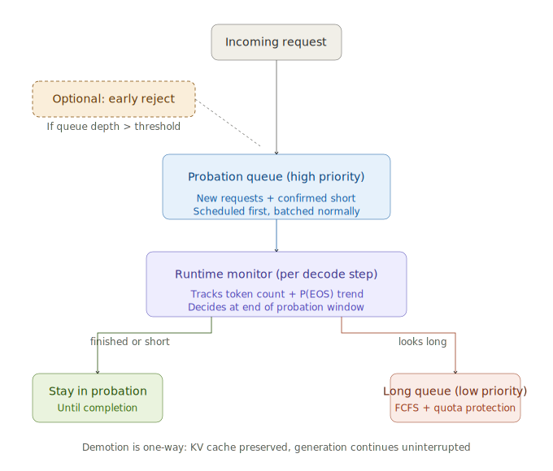
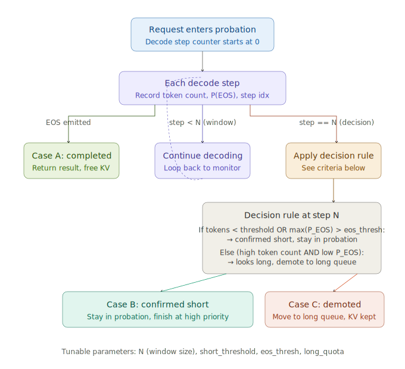

# Tail-Aware Request Scheduling — Design (Minimal Version)

## Architecture



The scheduler is built as a thin policy layer on top of vLLM's existing batching engine. Two priority queues replace vLLM's default FCFS waiting queue. Continuous batching, KV cache management, and forward execution are all unchanged — we only modify the request selection policy and add a runtime monitoring hook.

## Components

### 1. Two-queue MLFQ scheduler

We deliberately choose a **two-queue design** over traditional N-level MLFQ. Since queue assignment relies solely on runtime signals, the natural decision boundary is binary: *"still observing / confirmed short"* vs *"confirmed long"*. Adding intermediate queues would require additional thresholds without corresponding gains in signal granularity.

- **Probation queue (high priority).** All newly admitted requests enter here by default. They are scheduled first within each batching step. Once a request is confirmed as short by the runtime monitor, it stays in this queue until completion.
- **Long queue (low priority).** Requests demoted from probation continue generating here, with their KV cache preserved in place. To prevent starvation under sustained short-request load, the long queue is given a configurable **quota** (e.g., at least 20% of each batch slot is reserved for long-queue requests).

The scheduler interface is implemented as `n_queues=2` but generalized so future work can extend to more levels without restructuring.

### 2. Runtime monitor (the novelty core)

This is the only component that touches LLM internals. At every decode step, for every active request, the monitor records two signals:

- **Token count** — number of tokens generated so far. Free, model-agnostic.
- **P(EOS) trend** — the probability assigned to the EOS token (or the sum over all stop tokens for models with multiple) at the current step. Obtained from vLLM's `logprobs` field; if EOS falls outside the top-k returned by the sampler, treated as effectively zero. We track the per-request maximum P(EOS) over the last *N* steps as a robustness measure against single-step noise.

**Decision rule** (applied after a request reaches step *N*):

```text
Before N generated tokens:
  keep request in probation.

At each decode step after N:
  if generated_tokens >= short_threshold
     and max(P_EOS over recent N tokens) <= eos_thresh:
       demote to long queue.
  else:
       keep request in probation.
```

The decision is **one-way**: a request demoted to the long queue does not get promoted back, even if its later behavior looks short again. This avoids oscillation and simplifies fairness reasoning.

Tunable parameters: `N` (probation window size, e.g. 8–16 steps), `short_threshold` (token count, e.g. 64), `eos_thresh` (e.g. 0.05), `long_quota` (e.g. 0.2).

### 3. Optional / future-work extensions

These are deliberately scoped out of the minimal version. The main design is fully functional without them, and each can be added independently if time permits or as follow-up work.

- **Arrival-time length predictor.** A learned classifier (BERT-style or Learning-to-Rank) that pre-classifies requests at admission, allowing high-confidence short/long requests to skip the probation window. Existing work shows this is hard to make accurate and portable across models — we argue runtime signals are sufficient and validate this empirically.
- **Embedding-based runtime corrector** (TRAIL-style). Using LLM intermediate-layer hidden states with a trained MLP to refine length prediction during generation. More accurate than P(EOS) alone but model-specific and requires per-model retraining.
- **Preemption with KV swap-out.** When the probation queue has waiters and the GPU batch is saturated by long-queue requests, swap out the KV cache of selected long requests to make room. Implementation requires careful state-machine design and anti-thrashing safeguards; ROI depends on workload concurrency.
- **Early rejection under overload.** When total queue depth exceeds a threshold, reject new admissions (or apply degraded service like capped max output length). Orthogonal to the main scheduling policy.

## Workflow (per-request lifecycle)



**Three terminal cases for any admitted request:**

1. **Natural completion within probation window** — request emits EOS before step *N*. No classification ever happens; it just finishes at high priority. This is the common case for short requests.
2. **Confirmed short at step *N*** — request is still running but classified as short by the decision rule. Stays in probation, finishes at high priority.
3. **Demoted to long queue at step *N*** — request continues generating in the low-priority queue. Throughput preserved by `long_quota`; KV cache is never freed or recomputed during demotion.

The demotion event is a pure metadata change — no GPU work is wasted, no generation is interrupted, and the request's batch slot may even remain the same in the immediate next step (until the scheduler rebalances based on quotas).

## Edge cases worth discussing

The workflow diagram captures the happy path. A few situations are not drawn but will definitely come up in implementation, and we should agree on how to handle them up front.

**1. Will demoted requests in the long queue starve under sustained short-request load?**

Yes — this is the cost of the "demote-only, no preemption" choice. Three mitigation options exist: (a) accept starvation entirely, on the grounds that long requests are expected to be slow anyway (the Mooncake stance); (b) reserve a fixed quota of each batch slot for the long queue (e.g., 20%); (c) age requests up after waiting too long, which contradicts our one-way demotion design. We recommend option (b): it is simple to implement, gives a provable lower bound on long-request throughput, and keeps the state machine clean.

**2. What if at the end of the probation window, token count is still low but P(EOS) is also low?**

This is the "signal conflict" case: the request hasn't generated much, but shows no signs of finishing either. It might be a medium-length task that is just ramping up. We adopt an **optimistic** policy here — keep it in probation. The cost of being wrong is bounded: if the request really is long, its token count will exceed the threshold soon enough and trigger a demotion later. A more conservative alternative is to extend the observation window for ambiguous cases, but this adds complexity for marginal benefit.

**3. How exactly do we compute the P(EOS) "trend"?**

The simplest formulation is `max(P_EOS_history[-N:]) > eos_thresh` — if at any point in the recent window the EOS probability crossed a threshold (e.g., 0.05), we treat the model as "considering ending" and lean toward keeping the request in probation. A more robust version applies an EWMA (exponentially weighted moving average) to smooth out single-step spikes. We start with the simple `max()` formulation and revisit if the offline P(EOS) analysis (planned as a preliminary experiment) shows excessive noise.

---


That said, I recommend paying attention to a few key points:
1. Validate the usefulness of P(EOS) early. Before fully implementing the scheduler, it would be very helpful to run an offline analysis to verify whether P(EOS) trends correlate well with output length.
2. Plan for parameter sensitivity analysis. Since the system depends on several thresholds (N, short_threshold, eos_thresh, long_quota), it would be good to show that performance is robust across reasonable parameter ranges.